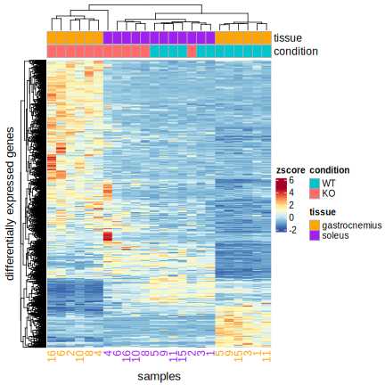

```{r setup, include=FALSE}
knitr::opts_chunk$set(echo = TRUE)

library(dplyr)
library(ggplot2)
library(ggfortify) # autoplot (PCA)
library(DESeq2)
# TODO: maybe just remove SE altogehter again?! seems to just bloat everything
library(SummarizedExperiment)
library(EnhancedVolcano)
library(eulerr)
```


## loading data

For the DESeq2 analysis, the raw, prefiltered counts will be used.

```{r loadRDS}
se.gastroc <- readRDS("./data/Robjects/01_se.gastroc.rds")
se.soleus <- readRDS("./data/Robjects/01_se.soleus.rds")

counts.gastroc <- se.gastroc[rowData(se.gastroc)$filtered,] %>% assay()
counts.soleus <- se.soleus[rowData(se.soleus)$filtered,] %>% assay()
metadata <- colData(se.gastroc)
```

## preparing DDS objects

```{r prepDDS, message=FALSE, warning=FALSE}
createDDSObject <- function(counts, metadata) {
  # select sample columns
  reorder_index <- match(rownames(metadata), colnames(counts))
  counts <- counts[,reorder_index]
  
  # Check metadata consistency
  all(rownames(metadata) %in% colnames(counts)) %>%
    assertthat::assert_that(., msg = "metadata and count table do not match")
  
  ## DESeq2 object
  dds <- DESeqDataSetFromMatrix(countData = counts,
                                colData = metadata,
                                design = ~ genotype)
  
  return( DESeq(dds) )
}

# creating DESeq Objects
dds.gastroc <- createDDSObject(counts.gastroc, metadata)
dds.soleus <- createDDSObject(counts.soleus, metadata)

# creating SESeqg Objects from SE
# dds.gastroc.se <- DESeqDataSet(se.gastroc, design = ~ genotype)
# dds.soleus.se <- DESeqDataSet(se.soleus, design = ~ genotype)
```

# Results

```{r results}
res.gastroc <- results(dds.gastroc, alpha = params$pCutoff, contrast = c("genotype", "KO", "WT"))
res.soleus <- results(dds.soleus, alpha = params$pCutoff, contrast = c("genotype", "KO", "WT"))
```

## MA-Plots

### gastroc

```{r ma.gastroc, message=FALSE, warning=FALSE}
plotMA(res.gastroc)
```

### soleus

```{r ma.soleus, message=FALSE, warning=FALSE}
plotMA(res.soleus)
```

## Dispersion Estimates

### gastroc

```{r dispEst.gastroc}
plotDispEsts(dds.gastroc)
```

### soleus

```{r dispEst.soleus}
plotDispEsts(dds.soleus)
```

## top significant diff. genes

```{r topDiffGenes.df}
topGenes.gastroc <- as.data.frame(res.gastroc) %>%
  tibble::rownames_to_column("GeneID") %>%
  top_n(100, wt = -padj) %>%
  arrange(padj)

topGenes.soleus <- as.data.frame(res.soleus) %>%
  tibble::rownames_to_column("GeneID") %>%
  top_n(100, wt = -padj) %>%
  arrange(padj)

knitr::kable(head(topGenes.gastroc), caption = "gastroc")
knitr::kable(head(topGenes.soleus), caption = "soleus")
```

## p-values

```{r pValuesHist}
# TODO: use ggplot for unified look of plots
hist(res.gastroc$pvalue, main = "gastroc")
hist(res.soleus$pvalue, main = "soleus")
```


## Volcano Plot
```{r volcanoPlot, warning=FALSE, fig.width = 9, fig.height = 9, fig.retina = 2, dpi = 100}
volcanoPlot <- function(result, se, pCutoff = 0.05, FCutoff = 1, tissue = character()) {
  gene_names <-
    rowData(se)[rownames(result), c("gene_name"), drop = F]
  results.df <- result %>%
    as.data.frame() %>%
    dplyr::arrange(padj)
  
  # top 10 gene labels for respectively up and down regulation
  labs.up <- results.df[results.df$log2FoldChange > FCutoff, ] %>%
    rownames() %>% .[1:10] %>% gene_names[., c("gene_name")]
  labs.down <- results.df[results.df$log2FoldChange < -FCutoff, ] %>%
    rownames() %>% .[1:10] %>% gene_names[., c("gene_name")]
  selectLab <- c(labs.up, labs.down, "Nfe2l1") %>% unique() # always including "Nfe2l1"
  
  # custom colors:
  keyvals <- ifelse(
    result$log2FoldChange < -FCutoff &
      result$padj < pCutoff,
    'royalblue',
    ifelse(
      result$log2FoldChange > FCutoff &
        result$padj < pCutoff,
      'red',
      'gray'
    )
  )
  keyvals[is.na(keyvals)] <- 'gray'
  names(keyvals)[keyvals == 'red'] <- 'up regulated'
  names(keyvals)[keyvals == 'gray'] <- 'nonsignificant'
  names(keyvals)[keyvals == 'royalblue'] <- 'down regulated'
  
  vlc.plt <- EnhancedVolcano(
    result,
    x = 'log2FoldChange',
    y = 'padj',
    title = 'WT vs KO: Nfe2l1 knockout',
    subtitle = ifelse(isEmpty(tissue), "", paste0('tissue: ', tissue)),
    caption = "",
    ylab = expression(paste(-Log[10], p[adj])),
    pCutoff = pCutoff,
    FCcutoff = FCutoff,
    legendPosition = 'right',
    pointSize = 2,
    colCustom = keyvals,
    lab = gene_names$gene_name,
    selectLab = selectLab,
    labSize = 3,
    boxedLabels = TRUE,
    drawConnectors = TRUE,
    max.overlaps = Inf
  )
  
  return(vlc.plt)
}


volcanoPlot(res.gastroc, se.gastroc, pCutoff = params$pCutoff, FCutoff = params$FCutoff, tissue = "gastrocnemius")

volcanoPlot(res.soleus, se.soleus, pCutoff = params$pCutoff, FCutoff = params$FCutoff, tissue = "soleus")

```

## scatter-plot: most differential genes, both tissues

using the Wald-test `stat` from the DESeq2 result and filtering on the set
`FCutoff=``r params$FCutoff` and `pCutoff=``r params$pCutoff` yields the following plot:
```{r topDiff.both, warning=FALSE, fig.width = 9, fig.height = 9, fig.retina = 2, dpi = 100}
apply_cutoffs <- function(deseq.result, colname="stat", FCutoff, pCutoff) {
  res.filtered <- deseq.result %>%
    data.frame() %>%
    filter(padj < pCutoff,
           log2FoldChange > FCutoff | log2FoldChange < -FCutoff) %>%
    dplyr::rename(!!colname := stat) %>%
    dplyr::select(!!colname)
  return(res.filtered)
}

gastroc_res.filtered <-
  apply_cutoffs(res.gastroc, colname = "gastroc", params$FCutoff, params$pCutoff)
soleus_res.filtered  <-
  apply_cutoffs(res.soleus,  colname = "soleus",  params$FCutoff, params$pCutoff)

gene_names <- rowData(se.gastroc) %>% as.data.frame() %>% 
  dplyr::select(gene_name)

# combining Wald-Test data from both tissues and ordering in quadrants
res.combined <- merge(gastroc_res.filtered,
                      soleus_res.filtered,
                      by = 0) %>%
  mutate(diff.exp = case_when(
    gastroc < 0 & soleus < 0 ~ "both down",
    gastroc > 0 & soleus > 0 ~ "both up",
    gastroc < 0 & soleus > 0 ~ "ga down, sol up",
    gastroc > 0 & soleus < 0 ~ "ga up, sol down",
    TRUE ~ "different"
  )) %>% 
  merge(gene_names, by.x="Row.names", by.y=0)
 
# removing all gene_names except the top_n_genes (sum of absolute Wald-test numbers)
top_n_genes <- 10
top_labels <- res.combined %>%
  group_by(diff.exp) %>% 
  arrange(desc(abs(gastroc) + abs(soleus))) %>%
  filter(row_number() %in% c(1:top_n_genes)) %>% 
  ungroup() %>% 
  .$gene_name

res.combined <- res.combined %>% 
  mutate(gene_name = ifelse(gene_name %in% top_labels, gene_name, ""))

# final plot
ggplot(res.combined, aes(x = gastroc, y = soleus, label = gene_name)) +
  geom_vline(xintercept = 0) + 
  geom_hline(yintercept = 0) + 
  geom_point(aes(color = diff.exp)) +
  # scale_color_manual(values = c("red", "chartreuse1", "bisque", "royalblue")) +
  labs(x = "gastroc", y = "soleus") +
  ggrepel::geom_label_repel(max.overlaps = 20) + 
  ggtitle(label = "stat (Wald test)") +
  theme_bw()
```

```{r include=FALSE}
# obtain gene counts for the respective groups for visualizing
sign_gene_stats <- list(
  "all genes" = nrow(gene_names),
  "gastroc" = nrow(gastroc_res.filtered),
  "soleus" = nrow(soleus_res.filtered),
  "shared_sig_genes" = nrow(res.combined),
  "both up" = sum(res.combined$diff.exp == "both up"),
  "both down" = sum(res.combined$diff.exp == "both down"),
  "ga up, sol down" = sum(res.combined$diff.exp == "ga up, sol down"),
  "ga down, sol up" = sum(res.combined$diff.exp == "ga down, sol up")
)
```


## barplot

```{r diffGenesBarPlot}
ggplot(res.combined, aes(x = diff.exp)) +
  geom_bar(aes(fill = diff.exp))
```


## boxplots: significant genes in both tissues


```{r boxplotSignGenes, message=FALSE, warning=FALSE}

boxplot.genes <- function(counts.df, title ="", FCutoff = 1) {
  
  ggplot(counts.df,
         aes(
           # x = as.factor(gene_name),
           x = reorder(gene_name,ensembl),
           y = normalized_counts,
           fill = genotype
         )) +
    geom_dotplot(
      binaxis = 'y',
      stackdir = 'center',
      dotsize = 0.3,
      position = position_dodge(0.8),
      fill = "black"
    ) +
    geom_boxplot(outlier.size = 0.3) +
    scale_y_log10() +
    xlab("Genes") +
    ylab("Normalized Counts") +
    scale_fill_manual(values = condition_pal) +
    ggtitle(title) +
    theme_bw() +
    theme(plot.title = element_text(hjust = 0.5)) +
    theme(axis.text.x = element_text(
      angle = 45,
      hjust = 1,
      face = setBold(counts.df$gene_name, c("Nfe2l1"))
    ))
}

prepare_counts <- function(gene_ids, dds, se, reorder_genes = F) {
  counts.top <- counts(dds, normalized = T)[gene_ids, ]
  metadata <- colData(se) %>% as.data.frame()
  gene_names <-
    rowData(se)[, c("gene_name"), drop = F] %>% as.data.frame()
  
  # the prepared counts df for the plot
  counts.plt <-
    data.frame(counts.top) %>%
    tibble::rownames_to_column(var = "ensembl") %>%
    tidyr::gather(key = "samplename",
                  value = "normalized_counts", 2:13) %>%
    merge(metadata, by.x = "samplename", by.y = 0) %>%
    merge(gene_names, by.x = "ensembl", by.y = 0)  %>%
    mutate(genotype = factor(genotype)) %>%
    mutate(genotype = relevel(genotype, "WT")) # "WT" needs to be displayed before "KO"
    
    if (reorder_genes) {
      counts.plt <- counts.plt %>%
        mutate(
          gene_name = forcats::fct_reorder(gene_name, normalized_counts, .desc = T),
          ensembl = forcats::fct_reorder(ensembl, normalized_counts, .desc = T)
        )
    } else {
      idx = match(counts.plt$ensembl, gene_ids)
      counts.plt <- counts.plt[order(idx),] %>%
        mutate(gene_name = factor(gene_name))# %>%
        # arrange(gene_name)
      counts.plt$ensembl <- factor(counts.plt$ensembl, levels = gene_ids,ordered = TRUE)
      counts.plt$gene_name <- factor(counts.plt$gene_name)

      # counts.plt$gene_name <- factor(counts.plt$gene_name, levels = gene_ids)
      # counts.plt <- counts.plt %>% 
      #   mutate(gene_name = factor(gene_name, levels = gene_ids)) %>% 
      #   arrange()
    }
  return(counts.plt)
}


# helper function to set the font of a label on the axis to bold
setBold <- function(src, special_labs) {
  # source: https://stackoverflow.com/questions/39694490/highlighting-individual-axis-labels-in-bold-using-ggplot2
  if (!is.factor(src))
    src <- factor(src)
  src_levels <- base::levels(src)
  brave <- special_labs %in% src_levels
  b_vec <- rep("plain", length(src_levels))
  if (all(brave)) {
    b_pos <- purrr::map_int(special_labs, ~ which(. == src_levels))
    b_vec[b_pos] <- "bold"
    b_vec
  } else {
    message("setBold: no matching element found")
  }
  return(b_vec)
}

# actual plot call
for (group in unique(res.combined$diff.exp)) {
  gene_ids <- filter(res.combined, diff.exp == group)$`Row.names`
  prep_counts.gastroc <- prepare_counts(gene_ids, dds.gastroc, se.gastroc, reorder_genes = T)
  prep_counts.soleus <-
    prepare_counts(levels(prep_counts.gastroc$ensembl), dds.soleus, se.soleus, reorder_genes = T)
  gene_ids <- levels(prep_counts.gastroc$ensembl)
  
  p.g <- boxplot.genes(
    counts.df = prep_counts.gastroc,
    title = paste0("Sign. regulated genes: ", group, "\n tissue: ", "gastroc")
  ) #%>% print()
  
  p.s <- boxplot.genes(
    counts.df = prep_counts.soleus,
    title = paste0("\n tissue: ", "soleus")
  ) #%>% print()
  
  ggpubr::ggarrange(p.g, p.s, ncol = 1, nrow = 2)
}
```


## boxplots: top 20 significant genes

```{r topDiffGenes}
setBold <- function(src, special_labs) {
  # source: https://stackoverflow.com/questions/39694490/highlighting-individual-axis-labels-in-bold-using-ggplot2
  if (!is.factor(src))
    src <- factor(src)
  src_levels <- base::levels(src)
  brave <- special_labs %in% src_levels
  b_vec <- rep("plain", length(src_levels))
  if (all(brave)) {
    b_pos <- purrr::map_int(special_labs, ~ which(. == src_levels))
    b_vec[b_pos] <- "bold"
    b_vec
  } else {
    message("setBold: no matching element found")
  }
  return(b_vec)
}

getTopExpressedEnsemblNames <- function(result,
                                        FCutoff,
                                        n,
                                        up = T) {
  .filter <- ifelse(up, `>`, `<`)
  
  subset(result, .filter(log2FoldChange, FCutoff)) %>%
    data.frame() %>%
    filter(baseMean > 100) %>%
    arrange(padj) %>%
    .[1:n, ] %>%
    rownames()
}

boxplot.top <- function(result, dds, se, upregulated=TRUE, n = 20, FCutoff = 1, tissue ="") {
  # getting the top n regulated genes
  names.top <- getTopExpressedEnsemblNames(result, FCutoff=FCutoff, n=n, up = upregulated)
  
  counts.top <- counts(dds, normalized=T)[names.top, ]
  metadata <- colData(se) %>% as.data.frame()
  gene_names <- rowData(se)[, c("gene_name"), drop = F] %>% as.data.frame()
  
  counts.plt <-
    data.frame(counts.top) %>%
    tibble::rownames_to_column(var = "ensembl") %>%
    tidyr::gather(key = "samplename",
           value = "normalized_counts", 2:13) %>%
    merge(metadata, by.x="samplename", by.y=0) %>%
    merge(gene_names, by.x="ensembl", by.y=0)  %>%
    mutate(genotype = factor(genotype)) %>%
    mutate(genotype = relevel(genotype, "WT"))  %>% # "WT" needs to be displayed before "KO"
    mutate(gene_name = forcats::fct_reorder(gene_name, normalized_counts, .desc = T))
  
  direction <- ifelse(upregulated, "up", "down")
  
  ggplot(counts.plt,
         aes(
           x = as.factor(gene_name),
           y = normalized_counts,
           fill = genotype
         )) +
    geom_dotplot(
      binaxis = 'y',
      stackdir = 'center',
      dotsize = 0.3,
      position = position_dodge(0.8),
      fill = "black"
    ) +
    geom_boxplot(outlier.size = 0.3) +
    scale_y_log10() +
    xlab("Genes") +
    ylab("Normalized Counts") +
    scale_fill_manual(values = condition_pal) +
    ggtitle(paste0("Top ", n, " ", direction, "-regulated Genes\n tissue: ", tissue)) +
    theme_bw() +
    theme(plot.title = element_text(hjust = 0.5)) +
    theme(axis.text.x = element_text(
      angle = 45,
      hjust = 1,
      face = setBold(counts.plt$gene_name, c("Nfe2l1"))
    ))
}
```

### gastroc

```{r topDiffBox.gastroc, warning=FALSE, message=FALSE}
boxplot.top(res.gastroc, dds.gastroc, se.gastroc, upregulated = T, tissue = "gastroc")
boxplot.top(res.gastroc, dds.gastroc, se.gastroc, upregulated = F, tissue = "gastroc")
```

### soleus

```{r topDiffBox.soleus, warning=FALSE, message=FALSE}
boxplot.top(res.soleus, dds.soleus, se.soleus, upregulated = T, tissue = "soleus")
boxplot.top(res.soleus, dds.soleus, se.soleus, upregulated = F, tissue = "soleus")
```


## Venn/Euler-Diagram

Here are some Venn or Euler (proportional Venn) diagrams to choose from.

Note: using Eulerr diagrams, yields inconsistent plots where the circle sets 
will be placed at different absolute positions each time the plot function is
called.
=> Thus the plot might need to be called multiple times until the wanted 
constellation is obtained.

significant overview with all genes:
```{r}
venn.colors <- c(genes = "white", tissue_pal)

gene_sets <- c(
  "all genes" = sign_gene_stats$`all genes` - sign_gene_stats$shared_sig_genes,
  "all genes&gastroc" = sign_gene_stats$gastroc - sign_gene_stats$shared_sig_genes,
  "all genes&soleus" = sign_gene_stats$soleus - sign_gene_stats$shared_sig_genes,
  "all genes&gastroc&soleus" = sign_gene_stats$shared_sig_genes
)

# 1st option: euler
plot(euler(gene_sets),
     legend = list(side = "right") ,
     main = "significant genes per tissue",
     fills = venn.colors)

# 2nd option: venn
plot(venn(gene_sets),
     main = "significant genes per tissue",
     fills = venn.colors)
```


significant grouped:

```{r vennDiagram}
col_palette <- RColorBrewer::brewer.pal(8, "Dark2")
# venn.colors <- c(gastroc = "#FFB08E", soleus = "#FF6638", col_palette[1:4])
venn.colors <- c(tissue_pal, scales::hue_pal()(4))

# sets for the venn/euler diagram (exclusive counts)
gene_sets <- c(
  "gastroc" = sign_gene_stats$gastroc - sign_gene_stats$shared_sig_genes,
  "soleus" = sign_gene_stats$soleus - sign_gene_stats$shared_sig_genes,
  "gastroc&soleus" = sign_gene_stats$shared_sig_genes,
  "gastroc&soleus&both down" = sign_gene_stats$`both down`,
  "gastroc&soleus&both up" = sign_gene_stats$`both up`,
  "gastroc&soleus&ga up, sol down" = sign_gene_stats$`ga up, sol down`,
  "gastroc&soleus&ga down, sol up" = sign_gene_stats$`ga down, sol up`
)
# 'gastroc&soleus': if this line is omitted, then all intersects will be denoted 
# with 0 (which was the goal to omit)

# 1st option: eulerr
plot(
  euler(gene_sets),
  quantities = T,
  legend = list(side = "right"),
  fills = venn.colors,
  main = "significant genes"
)


# only the two tissues
gene_sets <- c(
  "gastroc" = sign_gene_stats$gastroc - sign_gene_stats$shared_sig_genes,
  "soleus" = sign_gene_stats$soleus - sign_gene_stats$shared_sig_genes,
  "gastroc&soleus" = sign_gene_stats$shared_sig_genes
)


# 2nd option: euler two tissues
p <- plot(
  euler(gene_sets),
  quantities = T,
  legend = list(side = "right"),
  fills = venn.colors,
  main = "significant genes"
)
ggsave("./plots/03_euler.svg", p)
p


# 3rd option: venn two tissues
library(eulerr)
p <- plot(
  eulerr::venn(gene_sets),
  fills = tissue_pal,
  main = "significant genes"
)
ggsave("./plots/03_venn.svg", p)
p
```


# Heatmap

```{r fig.width=4, fig.height=4, message=FALSE}
library(ComplexHeatmap)
library(RColorBrewer)

zscore <- function(M) {
  s <- apply( M,1,sd )      # standard deviation
  µ <- apply( M, 1, mean )  # mean
  M.z <- (M - µ) / s        # zscore
  return(M.z)
}

sign_genes <-
  unique(c(
    row.names(gastroc_res.filtered),
    row.names(soleus_res.filtered)
  )) 
sign_genes <-
  sign_genes[sign_genes %in% rownames(counts.gastroc) &
               sign_genes %in% rownames(counts.soleus)]

counts_sign_zscored <- merge(
  zscore(counts.gastroc[sign_genes,]),
  zscore(counts.soleus[sign_genes,]),
  by = 0,
  suffixes = c(".ga", ".sol")
) %>% 
  tibble::column_to_rownames(var="Row.names") %>%
  as.matrix()


plotCHM <- function(counts_sign) {
  mypalette <- brewer.pal(11, "RdYlBu")
  # (reverse to map style of other heatmap in manuscript)
  morecols <- colorRampPalette(rev(mypalette))
  
  tissue_vec <- c(rep("gastroc", 12), rep("soleus", 12))
  condition_vec <- c(rep(c(rep("WT", 6), rep("KO", 6)),2))
  top_annot <-
    HeatmapAnnotation(
      tissue = tissue_vec,
      condition = condition_vec,
      col = list(tissue = tissue_pal, condition = c("WT" = "white", "KO" = "gray")),
      gp = gpar(col = "darkgray"),
      show_legend = FALSE
    )
  
  chm <- Heatmap(
    counts_sign,
    row_title = "genes",
    name = "zscore",
    show_row_names = FALSE,
    show_column_names = FALSE,
    column_title = "samples",
    col = rev(morecols(50)),
    column_title_side = "bottom",
    top_annotation = top_annot
  )
  
  # creating custom annotation legend (to obtain the gray border)
  condition_legend = Legend(
    labels = c("WT", "KO"),
    legend_gp = gpar(fill = c("white", "gray")),
    border = "darkgray",
    title = "condition"
  )
  tissue_legend = Legend(
    labels = c("gastroc", "soleus"),
    legend_gp = gpar(fill = c("orange", "purple")),
    border = "darkgray",
    title = "tissue"
  )
  legend_list <- list(condition_legend, tissue_legend)
  
  draw(chm, annotation_legend_list = legend_list)
}

svglite::svglite("./plots/03_heatmap_sign_genes.svg", width=6, height=6)
plotCHM(counts_sign_zscored)
dev.off()
```



## pca (z-scored)

```{r pca.both, message=FALSE}
pca <- prcomp(t(counts_sign_zscored), scale. = T)

pca.data <- data.frame(Sample = rownames(pca$x),
                     X = pca$x[, 1],
                     Y = pca$x[, 2]) %>%
mutate(type = substr(Sample, 1, 2),
       tissue = stringr::str_extract(Sample,"[:alpha:]+$"))

plt <-
autoplot(
  pca,
  data = pca.data,
  colour = 'type',
  shape = 'tissue',
  label.show.legend = FALSE
) +
ggtitle("PCA z-scored sign. genes")+
theme_bw()
ggsave(filename = "./plots/03_pca_dea_sign_zscored.svg")
plt
```

## pca (counts)
```{r}
counts_sign <-
  merge(counts.gastroc[sign_genes,],
        counts.soleus[sign_genes,],
        by = 0,
        suffixes = c("_gastroc", "_soleus")) %>%
  tibble::column_to_rownames("Row.names")

pca <- prcomp(t(counts_sign), scale. = T)

pca.data <- data.frame(Sample = rownames(pca$x),
                     X = pca$x[, 1],
                     Y = pca$x[, 2]) %>%
mutate(type = substr(Sample, 1, 2),
       tissue = stringr::str_extract(Sample,"[:alpha:]+$"))

plt <-
autoplot(
  pca,
  data = pca.data,
  colour = 'type',
  shape = 'tissue',
  label.show.legend = FALSE
) +
ggtitle("PCA sign. genes")+  
theme_bw()
ggsave(filename = "./plots/03_pca_dea_sign_counts.svg")
plt
 
 
```


# save R ojects

```{r saving_R_objects}
save(dds.gastroc, dds.soleus, res.gastroc, res.soleus, file = "./data/Robjects/03_DDS.RData")
```