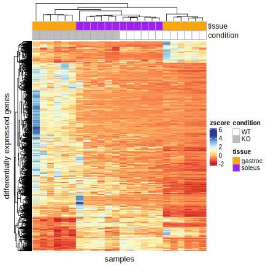

```{r setup, include=FALSE}
knitr::opts_chunk$set(echo = TRUE)
library(dplyr)
library(ggplot2)
library(ggfortify) # need for `autoplot()` (PCA)

# library(circlize)
library(RColorBrewer)
# library(SummarizedExperiment)
```

```{r include=FALSE}
path.currentPlots <- file.path(".", "plots", "current")
```


# 1. First Analysis

## Preparing data

```{r}
gastroc <-
  readr::read_tsv("./data/counts/readcount_genename_gastroc.xls",
                  show_col_types = F) %>%
  tibble::column_to_rownames(var = "gene_id")
counts.gastroc <- gastroc[, 1:12]

# TODO: fix annotations: several entries are incomplete whereas the gastroc seems to be complete
soleus <- readr::read_tsv("./data/counts/readcount_genename_soleus.xls", show_col_types = F) %>%
  tibble::column_to_rownames(var = "gene_id")
counts.soleus <- soleus[, 1:12]

```

### Filtering

omitting genes with zero counts in more than 30% of the samples

```{r omit_zero_counts, echo=FALSE}
omitZeroCounts <- function(counts.raw, share=0.3) {
  keep <- (counts.raw != 0) %>%
    rowSums() > round(share * ncol(counts.raw))
  return(counts.raw[keep,])
}

counts.gastroc <- omitZeroCounts(counts.gastroc)
counts.soleus <- omitZeroCounts(counts.soleus)
```


## most variable genes (top 1000) & Normalization
To obtain the most variable genes, a `z-score` will be applied per gene to then
take the `sd` and filter for the top 1000


z-score:

$\frac{x - mean(x)}{sd(x)}$

```{r zscore}
zscore <- function(M) {
  s <- apply( M,1,sd )      # standard deviation
  µ <- apply( M, 1, mean )  # mean
  M.z <- (M - µ) / s        # zscore
  return(M.z)
}

# ' returning the raw counts of the most variable genes by applying zscore and sd
mostVariableRows <- function(M, ntop=1000) {
  M.z <- zscore(M)
  
  # ordering by sd descending
  sdev <- apply(M.z, 1, sd)
  M.top <- M[order(sdev, decreasing = T)[1:ntop] , ]
  return(M.top)
}

counts.gastroc.top <- mostVariableRows(counts.gastroc)
counts.soleus.top <- mostVariableRows(counts.soleus)
```


## PCA

Here also taking the top 1000 most variable genes of each tissue and merging them.

```{r pca_filterd_genes, message=FALSE}

most_variable_genes <- c(row.names(counts.gastroc.top), row.names(counts.soleus.top)) %>% 
  unique()

counts.both <-
  merge(counts.gastroc[most_variable_genes, ],
        counts.soleus[most_variable_genes, ],
        by = 0,
        all = T,
        suffixes = c("_gastroc", "_soleus")) %>%
  tibble::column_to_rownames("Row.names") %>% 
  na.omit()

pca <- prcomp(t(counts.both), scale. = T)

pca.data <- data.frame(Sample = rownames(pca$x),
                       X = pca$x[, 1],
                       Y = pca$x[, 2]) %>%
  mutate(condition = substr(Sample, 1, 2),
         tissue = stringr::str_extract(Sample,"[:alpha:]+$"))

plt <-
  autoplot(
    pca,
    data = pca.data,
    colour = 'tissue',
    shape = 'condition',
    label.show.legend = FALSE
  ) +
  scale_color_manual(values = params$tissue_pal) +
  ggtitle("PCA top 1000 most variable genes of each tissue (sd)")+
  theme_bw()
ggsave(filename = file.path(path.currentPlots, "01_pca_both_tissues_filtered.svg"), plt)
plt
```

This plot looks different than before! The overall cluster sill exist, but slightly shifted and rotated. The PC1 has now 48% whereas it previously had 40% and PC2 26% vs 25%.

I thought I did not change anything and after another plotting run, the plot changed. Cleaning environment and workspace did not change anything.


# 2. DESeq

```{r setupDeseq, include=FALSE}
if (! "ComplexHeatmap" %in% row.names(installed.packages())) {
  devtools::install_github("jokergoo/ComplexHeatmap", force = TRUE)
  # BiocManager::install("ComplexHeatmap")
}
library(ComplexHeatmap)
library(EnhancedVolcano)
library(eulerr)
library(SummarizedExperiment)

load("./data/Robjects/03_DDS.RData")

se.gastroc <- readRDS("./data/Robjects/01_se.gastroc.rds")
se.soleus <- readRDS("./data/Robjects/01_se.soleus.rds")

```


## Volcano Plot
```{r volcanoPlot, warning=FALSE, fig.width = 9, fig.height = 9, fig.retina = 2, dpi = 100}
volcanoPlot <- function(result, se, pCutoff = 0.01, FCutoff = 1, tissue = character()) {
  gene_names <-
    rowData(se)[rownames(result), c("gene_name"), drop = F]
  results.df <- result %>%
    as.data.frame() %>%
    dplyr::arrange(padj)
  
  # top 10 gene labels for respectively up and down regulation
  labs.up <- results.df[results.df$log2FoldChange > FCutoff, ] %>%
    rownames() %>% .[1:10] %>% gene_names[., c("gene_name")]
  labs.down <- results.df[results.df$log2FoldChange < -FCutoff, ] %>%
    rownames() %>% .[1:10] %>% gene_names[., c("gene_name")]
  selectLab <- c(labs.up, labs.down, "Nfe2l1") %>% unique() # always including "Nfe2l1"
  
  # custom colors:
  keyvals <- ifelse(
    result$log2FoldChange < -FCutoff &
      result$padj < pCutoff,
    params$regulated_pal$upregulated,
    ifelse(
      result$log2FoldChange > FCutoff &
        result$padj < pCutoff,
      params$regulated_pal$downregulated,
      params$regulated_pal$insignificant
    )
  )

  keyvals[is.na(keyvals)] <- params$regulated_pal$insignificant
  names(keyvals)[keyvals == params$regulated_pal$upregulated] <- 'up regulated'
  names(keyvals)[keyvals == params$regulated_pal$insignificant] <- 'nonsignificant'
  names(keyvals)[keyvals == params$regulated_pal$downregulated] <- 'down regulated'
  
  vlc.plt <- EnhancedVolcano(
    result,
    x = 'log2FoldChange',
    y = 'padj',
    title = 'WT vs KO: Nfe2l1 knockout',
    subtitle = ifelse(isEmpty(tissue), "", paste0('tissue: ', tissue)),
    caption = "",
    ylab = expression(paste(-Log[10], p[adj])),
    pCutoff = pCutoff,
    FCutoff = FCutoff,
    legendPosition = 'right',
    pointSize = 2,
    colCustom = keyvals,
    lab = gene_names$gene_name,
    selectLab = selectLab,
    labSize = 3,
    boxedLabels = TRUE,
    drawConnectors = TRUE,
    max.overlaps = Inf
  )
  
  return(vlc.plt)
}


p <- volcanoPlot(res.gastroc, se.gastroc, pCutoff = params$pCutoff, FCutoff = params$FCutoff, tissue = "gastrocnemius")
ggsave(filename = file.path(path.currentPlots, "02_volcano_gastroc.svg"), p)
p
p <- volcanoPlot(res.soleus, se.soleus, pCutoff = params$pCutoff, FCutoff = params$FCutoff, tissue = "soleus")
ggsave(filename = file.path(path.currentPlots, "02_volcano_soleus.svg"), p)
p
```

## scatter-plot: most differential genes, both tissues

using the Wald-test `stat` from the DESeq2 result and filtering on the set
`FCutoff=``r params$FCutoff` and `pCutoff=``r params$pCutoff` yields the following plot:
```{r scatterDEA, warning=FALSE, fig.width = 9, fig.height = 9, fig.retina = 2, dpi = 100}
apply_cutoffs <- function(deseq.result, colname="stat", FCutoff, pCutoff) {
  res.filtered <- deseq.result %>%
    data.frame() %>%
    filter(padj < pCutoff,
           log2FoldChange > FCutoff | log2FoldChange < -FCutoff) %>%
    dplyr::rename(!!colname := stat) %>%
    dplyr::select(!!colname)
  return(res.filtered)
}

gastroc_res.filtered <- apply_cutoffs(res.gastroc, colname="gastroc", params$FCutoff, params$pCutoff)
soleus_res.filtered  <- apply_cutoffs(res.soleus,  colname="soleus",  params$FCutoff, params$pCutoff)

gene_names <- rowData(se.gastroc) %>% as.data.frame() %>% 
  dplyr::select(gene_name)

# combining Wald-Test data from both tissues and ordering in quadrants
res.combined <- merge(gastroc_res.filtered,
                      soleus_res.filtered,
                      by = 0) %>%
  mutate(diff.exp = case_when(
    gastroc < 0 & soleus < 0 ~ "both down",
    gastroc > 0 & soleus > 0 ~ "both up",
    gastroc < 0 & soleus > 0 ~ "gastrocnemius down,\n soleus up",
    gastroc > 0 & soleus < 0 ~ "gastrocnemus up,\n soleus down",
    TRUE ~ "different"
  )) %>% 
  merge(gene_names, by.x="Row.names", by.y=0)
 
# removing all gene_names except the top_n_genes (sum of absolute Wald-test numbers)
top_n_genes <- 10
top_labels <- res.combined %>%
  group_by(diff.exp) %>% 
  arrange(desc(abs(gastroc) + abs(soleus))) %>%
  filter(row_number() %in% c(1:top_n_genes)) %>% 
  ungroup() %>% 
  .$gene_name

res.combined <- res.combined %>% 
  mutate(gene_name = ifelse(gene_name %in% top_labels, gene_name, ""))

# final plot
p <- ggplot(res.combined, aes(x = gastroc, y = soleus, label = gene_name)) +
  geom_vline(xintercept = 0) + 
  geom_hline(yintercept = 0) + 
  geom_point(aes(color = diff.exp)) +
  # scale_color_manual(values = c("red", "chartreuse1", "bisque", "royalblue")) +
  labs(x = "gastroc", y = "soleus", color = "significantly\ndifferentially\nexpressed") +
  ggrepel::geom_label_repel(max.overlaps = 15) + 
  ggtitle(label = "DEA: t-statistics (Wald test)") +
  theme_bw() +
  theme(
    axis.title = element_text(size = 13),
    axis.text = element_text(size = 13),
    title = element_text(size = 13),
    legend.text = element_text(size = 10)
  )

ggsave(filename = file.path(path.currentPlots, "02_dea_scatter.svg"), p)
p
```


### barplot

```{r dea_scatter_barplot}
p <- ggplot(res.combined, aes(x = diff.exp)) +
  geom_bar(aes(fill = diff.exp)) +
  theme_bw()
ggsave(filename = file.path(path.currentPlots, "02_dea_scatter_barplot.svg"), p)
p
```

```{r include=FALSE}
# obtain gene counts for the respective groups for visualizing
sign_gene_stats <- list(
  "all genes" = nrow(gene_names),
  "gastroc" = nrow(gastroc_res.filtered),
  "soleus" = nrow(soleus_res.filtered),
  "shared_sig_genes" = nrow(res.combined),
  "both up" = sum(res.combined$diff.exp == "both up"),
  "both down" = sum(res.combined$diff.exp == "both down"),
  "ga up, sol down" = sum(res.combined$diff.exp == "ga up, sol down"),
  "ga down, sol up" = sum(res.combined$diff.exp == "ga down, sol up")
)
```


## Venn/Euler-Diagram

```{r vennDiagram}
venn.colors <- c(params$tissue_pal, scales::hue_pal()(4))

# only the two tissues
gene_sets <- c(
  "gastroc" = sign_gene_stats$gastroc - sign_gene_stats$shared_sig_genes,
  "soleus" = sign_gene_stats$soleus - sign_gene_stats$shared_sig_genes,
  "gastroc&soleus" = sign_gene_stats$shared_sig_genes
)

# 1st option: euler two tissues
p <- plot(
  euler(gene_sets),
  quantities = T,
  legend = list(side = "right"),
  fills = venn.colors,
  main = "significant genes"
)
ggsave(filename = file.path(path.currentPlots, "02_euler.svg"), p)
p

# 2nd option: venn two tissues
library(eulerr)
p <- plot(
  eulerr::venn(gene_sets),
  fills = params$tissue_pal,
  main = "significant genes"
)
ggsave(filename = file.path(path.currentPlots, "02_venn.svg"), p)
p
```


## Heatmap

```{r fig.width=4, fig.height=4, message=FALSE}
library(ComplexHeatmap)
library(RColorBrewer)

zscore <- function(M) {
  s <- apply( M,1,sd )      # standard deviation
  µ <- apply( M, 1, mean )  # mean
  M.z <- (M - µ) / s        # zscore
  return(M.z)
}

sign_genes <-
  unique(c(
    row.names(gastroc_res.filtered),
    row.names(soleus_res.filtered)
  )) 
sign_genes <-
  sign_genes[sign_genes %in% rownames(counts.gastroc) &
               sign_genes %in% rownames(counts.soleus)]

counts_sign_zscored <- merge(
  counts.gastroc[sign_genes,],
  counts.soleus[sign_genes,],
  by = 0,
  suffixes = c(".gastroc", ".soleus")
) %>% 
  tibble::column_to_rownames(var="Row.names") %>%
  as.matrix() %>% 
  zscore()


plotCHM <- function(counts_sign) {
  # http://colorbrewer2.org/#type=sequential&scheme=BuGn&n=3
  morecols <- colorRampPalette(params$heatmap_pal)
  
  tissue_vec <- c(rep("gastroc", 12), rep("soleus", 12))
  condition_vec <- c(rep(c(rep("WT", 6), rep("KO", 6)),2))
  top_annot <-
    HeatmapAnnotation(
      tissue = tissue_vec,
      condition = condition_vec,
      col = list(tissue = params$tissue_pal, condition = params$condition_pal),
      gp = gpar(col = "darkgray"),
      show_legend = FALSE
    )
  
  chm <- Heatmap(
    counts_sign,
    row_title = "differentially expressed genes",
    name = "zscore",
    show_row_names = FALSE,
    show_column_names = FALSE,
    column_title = "samples",
    col = morecols(50),
    column_title_side = "bottom",
    top_annotation = top_annot
  )
  
  # creating custom annotation legend (to obtain the gray border)
  condition_legend = Legend(
    labels = c("WT", "KO"),
    legend_gp = gpar(fill = c("white", "gray")),
    border = "darkgray",
    title = "condition"
  )
  tissue_legend = Legend(
    labels = c("gastroc", "soleus"),
    legend_gp = gpar(fill = unname(params$tissue_pal)),
    border = "darkgray",
    title = "tissue"
  )
  legend_list <- list(condition_legend, tissue_legend)
  
  draw(chm, annotation_legend_list = legend_list)
}

svglite::svglite(
  file.path(path.currentPlots, "02_heatmap_sign_genes.svg"),
  width = 6,
  height = 6
)
plotCHM(counts_sign_zscored)
dev.off()
```



### pca: significant genes
Here the z-scored count matrix is used to create the pca plot.
Whether the counts are z-scored or not, does not change the plot, as long as the z-score is applied on the whole matrix (not per tissue)

```{r pca.zscored, message=FALSE}
pca <- prcomp(t(counts_sign_zscored), scale. = T)

pca.data <- data.frame(Sample = rownames(pca$x),
                     X = pca$x[, 1],
                     Y = pca$x[, 2]) %>%
mutate(condition = substr(Sample, 1, 2),
       tissue = stringr::str_extract(Sample,"[:alpha:]+$"))

p <-
autoplot(
  pca,
  data = pca.data,
  colour = 'tissue',
  shape = 'condition',
  label.show.legend = FALSE
) +
  ggtitle("PCA significantly differentially expressed genes") +
  scale_color_manual(values = unname(params$tissue_pal)) +
  theme_bw()
ggsave(filename = file.path(path.currentPlots, "02_pca_dea_sign.svg"), p)
p
```

# 3. fgsea

```{r fgseaSetup, include=FALSE}
library(fgsea)
library(patchwork) # to add dotplots: p.gastroc+  p.soleus

load("./data/Robjects/02_annot.RData") # for entrezgene_id
```


```{r reading_pathways, include=FALSE}
# canonical pathways (1687 gene sets):
CGP <- qusage::read.gmt("./data/pathways/m2.cp.v2022.1.Mm.entrez.gmt")
```


## ranks

```{r getting_ranks}
getRanks <- function(res, annot) {
  # only taking genes which have entrezgene_ids assigned to them
  genes_with_entrez <- select(annot, GeneID, entrezgene_id) %>% 
    filter(!is.na(entrezgene_id))
  
  ranks <- as.data.frame(res) %>%
    tibble::rownames_to_column("GeneID") %>%
    merge(genes_with_entrez, by = "GeneID") %>%
    arrange(desc(stat)) %>% 
    select(entrezgene_id, stat) %>% 
    tibble::deframe() # creating a named num from two columns
  return(ranks)
}

ranks.gastroc <- getRanks(res.gastroc, annot)
ranks.soleus <- getRanks(res.soleus, annot)
# TODO: why (again) is the soleus gene count seemingly 300 below soleus gene count / ranks count
# -> seems because of e.g. the cutoff at DESeq
```

## applying fgsea

    fgseaRes <- fgsea(
      pathways = CGP,
      stats    = ranks,
      minSize  = 15,
      maxSize  = `r params$fgsea.maxSize`
    )

```{r fgsea_res_load, include=FALSE}
# ' returns the fgsea result
# ' `tissue` needs to be one of {"soleus", "soleus"}
# ' Also saves the results locally to avoid too much queries
get_fgseaRes <- function(tissue, ranks, maxSize=params$fgsea.maxSize, pathways=CGP, saveResults=T) {
  robjects.path <- file.path(".", "data", "Robjects")
  fgseaRes.path <- file.path(
    robjects.path,
    "04_fgsea_results",
    tissue,
    paste0("maxSize_", params$fgsea.maxSize, ".rds")
  )
  fgseaRes.dir <- dirname(fgseaRes.path)
  
  if (file.exists(fgseaRes.path) & !params$reevaluate) {
    message("fgsea result found in directory! Previous version will be loaded ...")
    return(readRDS(file = fgseaRes.path))
  } else {
    # perform fgsea and save the result
    fgseaRes <- fgsea(
      pathways = pathways,
      stats    = ranks,
      minSize  = 15,
      maxSize  = maxSize
    )
    
    if (saveResults) {
      if (!dir.exists(fgseaRes.dir))
        dir.create(fgseaRes.dir, recursive = T)
      saveRDS(fgseaRes, file = fgseaRes.path)
    }
    return(fgseaRes)
  }
}

fgseaRes.gastroc <- get_fgseaRes("gastroc", ranks.gastroc, pathways=CGP)
fgseaRes.soleus <- get_fgseaRes("soleus", ranks.soleus, pathways=CGP)
```


## most differential regulated pathways, both tissues

using `NES` from the fgsea result filtering on the set ``` pCutoff=``r params$pCutoff ``` yields the following plot:

```{r topDiff.both, warning=FALSE}

pCutoff <- params$pCutoff
fgseaRes.combined <- merge(
  data.frame(fgseaRes.gastroc[, c("pathway", "NES", "padj")]),
  data.frame(fgseaRes.soleus[, c("pathway", "NES", "padj")]),
  by = "pathway",
  suffixes = c(".ga", ".sol")
) %>%
  filter(padj.ga < pCutoff | padj.sol < pCutoff) %>%
  mutate(
    diff.exp = case_when(
      NES.ga  < 0 & NES.sol < 0 & padj.ga < pCutoff & padj.sol < pCutoff ~ "both down",
      NES.ga  > 0 & NES.sol > 0 & padj.ga < pCutoff & padj.sol < pCutoff ~ "both up",
      NES.ga  < 0 & NES.sol > 0 & padj.ga < pCutoff & padj.sol < pCutoff ~ "gastrocnemius down, soleus up",
      NES.ga  > 0 & NES.sol < 0 & padj.ga < pCutoff & padj.sol < pCutoff ~ "gastrocnemius up, soleus down",
                                  padj.ga < pCutoff & padj.sol > pCutoff ~ "only gastrocnemius",
      # NES.ga  > 0 &               padj.ga < pCutoff & padj.sol > pCutoff ~ "ga up",
                                  padj.ga > pCutoff & padj.sol < pCutoff ~ "only soleus",
      # NES.sol > 0 &               padj.ga > pCutoff & padj.sol < pCutoff ~ "sol up",
      TRUE ~ "different"
    )
  )

# final plot
p <- ggplot(fgseaRes.combined, aes(x = NES.ga, y = NES.sol, text=pathway)) +
  geom_vline(xintercept = 0) + 
  geom_hline(yintercept = 0) + 
  geom_point(aes(color = diff.exp)) +
  # scale_color_manual(values = c("red", "chartreuse1", "bisque", "royalblue")) +
  labs(x = "gastrocnemius", y = "soleus", color = "significantly\ndifferentially\nexpressed") +
  # ggrepel::geom_label_repel(max.overlaps = 20) + 
  ggtitle(label = "Normalized Enrichment Score") +
  theme_bw()

ggsave(filename = file.path(path.currentPlots, "03_gsea_scatter.svg"), p)
p

# interactive:
# plotly::ggplotly(p, tooltip = "all")
```


### barplot

```{r gsea_scatter_barplot}
p <- ggplot(fgseaRes.combined, aes(x = diff.exp)) +
  geom_bar(aes(fill = diff.exp)) +
  theme_bw()

ggsave(filename = file.path(path.currentPlots, "03_gsea_scatter_barplot.svg"), p)
p
```

### Venn/Euler-Diagram

```{r vennDiagramGSEA}
venn.colors <- c(params$tissue_pal, scales::hue_pal()(4))

sign_geneSets_gastroc <-
  data.frame(fgseaRes.gastroc[, c("pathway", "padj")]) %>%
  filter(padj < params$pCutoff) %>% 
  pull(pathway)


sign_geneSets_soleus <-
  data.frame(fgseaRes.soleus[, c("pathway", "padj")]) %>%
  filter(padj < params$pCutoff) %>% 
  pull(pathway)

# only the two tissues
gene_sets <- list(
  "gastroc" = sign_geneSets_gastroc,
  "soleus" = sign_geneSets_soleus#,
  # "gastroc&soleus" = sign_gene_stats$shared_sig_genes
)

# 1st option: euler two tissues
p <- plot(
  euler(gene_sets),
  quantities = T,
  legend = list(side = "right"),
  fills = venn.colors,
  main = "significant gene sets (GSEA)"
)
ggsave(filename = file.path(path.currentPlots, "03_euler.svg"), p)
p

# 2nd option: venn two tissues
library(eulerr)
p <- plot(
  eulerr::venn(gene_sets),
  fills = params$tissue_pal,
  main = "significant gene sets (GSEA)"
)
ggsave(filename = file.path(path.currentPlots, "03_venn.svg"), p)
p
```


### dotplot
```{r}
combined_dotplot <-
  function(group,
           fgseaRes.combined = fgseaRes.combined,
           max_label_length = 25, topn=6e6, sort_by_gastroc=T) {
    
    # get pathways of the respective group
    pathways <- filter(fgseaRes.combined, diff.exp == group)$pathway
    
    gastroc.df <-
      filter(fgseaRes.gastroc, pathway %in% pathways)
    soleus.df <-
      filter(fgseaRes.soleus, pathway %in% gastroc.df$pathway)
    
    if (sort_by_gastroc) {
      gastroc.df <- gastroc.df %>% 
        top_n(topn, wt = abs(NES)) %>%
        arrange(NES)
      soleus.df <- soleus.df %>% 
        .[match(gastroc.df$pathway, pathway)]
    } else {
      soleus.df <- soleus.df %>% 
        top_n(topn, wt = abs(NES)) %>%
        arrange(NES)
      gastroc.df <- gastroc.df %>% 
        .[match(soleus.df$pathway, pathway)]
    }
	
    padj_limits <-
      c(min(gastroc.df$padj, soleus.df$padj),
        max(gastroc.df$padj, soleus.df$padj))
    
    NES_limits <- 
      c(min(gastroc.df$NES, soleus.df$NES),
        max(gastroc.df$NES, soleus.df$NES))
    
    p.gastroc <- fgsea_dotplot(gastroc.df, max_label_length, padj_limits, NES_limits)

    p.soleus <- fgsea_dotplot(soleus.df, max_label_length, padj_limits, NES_limits)
    
    # adjust plots
    p.gastroc <- p.gastroc +
      theme(
        legend.position = "none",
        plot.margin = unit(c(0, 0, 0, 0), "npc"),
      ) +
      ylab("NES\n(gastroc)") + 
      xlab("")
    p.soleus <- p.soleus +
      theme(
        axis.text.y = element_blank(),
        plot.margin = unit(c(0, 0, 0, 0), "npc")
      ) +
      ylab("NES\n(soleus)") + 
      xlab("")
    
    return(p.gastroc + p.soleus)
  }


fgsea_dotplot <-
  function(fgseaRes.df,
           max_label_length=25,
           padj_limits=NULL,
           NES_limits=NULL) {
  size_breaks <- seq(0,200,by=50)
  size_breaks[1] <- 10
  size_range <- c(2,8)
  
  # adjust label size if the plot has too many sets:
  label_size <- 8
  nsets <- nrow(fgseaRes.df)
  if (nsets > 15) {
    
    label_size <- label_size - (0.05 * nsets)
    max_label_length <- nsets + 10
    size_range <- size_range -1
  }
  
  fgseaRes_prep.df <- fgseaRes.df %>%
    # TODO: might need to be changed if other labels are used (like description)
    mutate(pathway = gsub("_", " ", pathway) %>% tolower()) %>%
    mutate(pathway = factor(pathway, levels = pathway))
  # the factor levels might be different than the order of the rows
  
  ggplot(fgseaRes_prep.df, aes(x = pathway, y = NES)) +
    geom_point(aes(size = size, color = padj)) +
    scale_color_gradient(low = "red",
                         high = "blue",
                         limits = padj_limits) +
    scale_size_continuous(range = size_range,
                          breaks = size_breaks,
                          limits = c(10, 200)) +
    scale_y_continuous(limits = NES_limits) +
    # scale_x_discrete(guide = guide_axis(check.overlap = TRUE))+
    scale_x_discrete(labels = scales::label_wrap(max_label_length)) +
    xlab("Gene Set") + ylab("NES") +
    labs(size = "Count", color = "p.adjust") +
    theme_bw() +
    coord_flip() +
    theme(axis.text.y = element_text(size = label_size))
  }
```

> Note: Different to most other plots, the dotplots seem to be created best by running the chunks manually. This results in automatic axis scaling with more entries, so that the labels do not overlap (which is curiously not the case if remotely knitting)!


#### dotplot: "both upregulated"
only 7 gene sets => fits well in the plot
```{r dotplotBothUp}
group = "both up"
p_combined <- combined_dotplot(group, fgseaRes.combined)

# ggsave(filename = file.path(path.currentPlots, paste0("03_gsea_dotplot_", group, ".svg")),
#        p_combined)
p_combined
```


#### dotplot: "both down"
gets adjusted by the function well. The .svg file looks okay
```{r dotplotBothDown}
group = "both down"
p_combined <- combined_dotplot(group, fgseaRes.combined)

# ggsave(filename = file.path(path.currentPlots, paste0("03_gsea_dotplot_", group, ".svg")),
#        p_combined)
p_combined
```


#### dotplot: "only gastrocnemius"
gets adjusted by the function well. The .svg file looks okay

```{r dotplotGastroc}
group = "only gastrocnemius"
p_combined <- combined_dotplot(group, fgseaRes.combined, max_label_length = 100)

# ggsave(filename = file.path(path.currentPlots, paste0("03_gsea_dotplot_", group, ".svg")),
#        p_combined)
p_combined
```

```{r dotplotGastrocSingle}
group = "only gastrocnemius"
pathways <- filter(fgseaRes.combined, diff.exp == group)$pathway

gastroc.df <-
  filter(fgseaRes.gastroc, pathway %in% pathways) %>%
  arrange(NES)

p.gastroc <- fgsea_dotplot(gastroc.df, max_label_length = 100)
# ggsave(filename = file.path(path.currentPlots, paste0("03_gsea_dotplot_", group, "_single.svg")),
#        p.gastroc)
p.gastroc
```


#### dotplot: "only soleus"
gets adjusted by the function well. The .svg file looks okay

```{r dotplotSoleus}
group = "only soleus"
p_combined <- combined_dotplot(group, fgseaRes.combined, max_label_length = 100, sort_by_gastroc = F)

# ggsave(filename = file.path(path.currentPlots, paste0("03_gsea_dotplot_", group, ".svg")),
#        p_combined)
p_combined
```


```{r dotplotSoleusSingle}
group = "only soleus"
pathways <- filter(fgseaRes.combined, diff.exp == group)$pathway

soleus.df <-
  filter(fgseaRes.soleus, pathway %in% pathways) %>%
  arrange(NES)

p.soleus <-
  fgsea_dotplot(soleus.df, max_label_length = 100)
# ggsave(filename = file.path(path.currentPlots, paste0("03_gsea_dotplot_", group, "_single.svg")),
#        p.soleus)
p.soleus
```

#### dotplot: top20
```{r include=FALSE}
for (group in unique(fgseaRes.combined$diff.exp)) {
  p_combined <- combined_dotplot(group, fgseaRes.combined)
  
  ggsave(filename = file.path(path.currentPlots, paste0("03_gsea_dotplot_", group, ".svg")),
         p_combined)
  print(p_combined)
}
```

