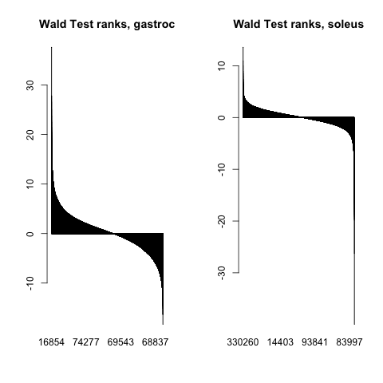

```{r setup, include=FALSE}
# knitr::opts_chunk$set(echo = TRUE)
knitr::opts_chunk$set(echo = TRUE,
                      fig.width = 9,
                      fig.height = 9,
                      fig.retina = 2, dpi = 100)
# knitr::opts_knit$set(root.dir = rprojroot::find_root(".Rhistory"))
```


```{r parameters, include=FALSE}
if (! exists("knitting_parameters_used")) {
  # when knitting with parameters the following variables are already set
  FCutoff <- 1
  pCutoff <- 0.01
  reevaluate <- FALSE
} 
```


## some title

$x -\frac{ mean(x)}{sd(x)}$

```{r checkingStuff, warning=TRUE}
FCutoff > 0
warning("current wd: ", getwd())

# now the grDevice size
interactive()
warning("grDevice size: ", grDevices::dev.size())
```


```{r}
# creating variable
a <- "23"
```

```{}
changingR <- function(a) {
  `r a` + 7
}
```


```{r fgsea_sample, eval=FALSE}
fgseaRes <- fgsea(
  pathways = CGP,
  stats    = ranks,
  minSize  = 15,
  maxSize  = `r a` # (see above if other value was used)
)
```


```{ fgsea_sample}
fgseaRes <- fgsea(
  pathways = CGP,
  stats    = ranks,
  minSize  = 15,
  maxSize  = `r a` # (see above if other value was used)
)
```


```{}
fgseaRes <- fgsea(
  pathways = CGP,
  stats    = ranks,
  minSize  = 15,
  maxSize  = `r a` # (see above if other value was used)
)
```


Adjusting the size of plots, by using the chunk parameters causes some inconsistencies
when using different screen resolutions. Thus it might be better to save plots with exact
resolution.
Some relating discussions can be found here:

* [plots on different monitors](https://github.com/rstudio/rmarkdown/issues/1827)
* [true plots gist](https://gist.github.com/debruine/baa61e561935d5e0df1ea0f294399c6c)


```{r ranks_barplot, echo=FALSE}
# no idea how to plot this with ggplot (one column) ...

# ggpubr::ggarrange(
# TODO: prettify
barplot.file <- "./plots/04_barplot_ranks.png"
# if (!file.exists(barplot.file)) {
#   png(barplot.file)
#     par(mfrow = c(1, 2))
#     barplot(sort(ranks.gastroc, decreasing = T), main = "Wald Test ranks, gastroc")
#     barplot(sort(ranks.soleus, decreasing = T), main = "Wald Test ranks, soleus")
#   dev.off()
# }
# )
knitr::include_graphics(barplot.file)
```

<!--  -->
